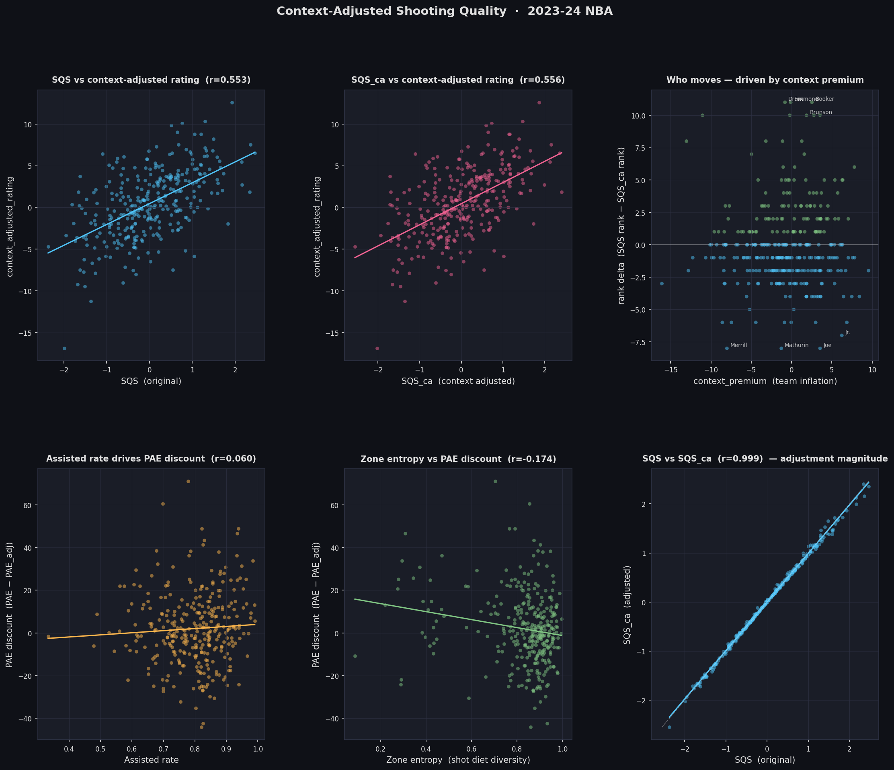

# NBA Context-Adjusted Shooting Quality · 2023-24

The third in a three-part portfolio series on NBA player evaluation. This repo corrects shooting quality (SQS) and player value for team context and role dependency — isolating genuine individual contribution from team-manufactured performance.

---

## Visualisations



---

## The arc

**[nba-analytics](https://github.com/babyteej/nba-analytics)**
Found that `e_net_rating` carries ~22% team context. Players on good teams have systematically inflated individual ratings.

**[nba-sqs](https://github.com/babyteej/nba-sqs)**
Decomposed shooting efficiency into per-shot skill (PPSA_adj) and volume contribution (PAE). Found that PAE rewards sheltered role players whose shot diet is manufactured by their team's offense — the same team context problem, operating at the shot level.

**This repo**
Corrects both. Three adjustment layers produce a context-adjusted shooting quality score (SQS_ca) that answers: *who are actually the best shooters, independent of team context and role?*

---

## The problem

A rim-runner on a top offense — think Luke Kornet on the 2024 Celtics — posts strong PAE numbers because he converts efficiently at the rim. But those shots aren't self-created. His teammates generate the looks. The PAE credit belongs partly to the system, not the player.

The same distortion exists at the net rating level. Players on good teams accumulate positive e_net_rating partly through team quality, not individual contribution. The Ridge model in nba-analytics quantified this gap as `context_premium`.

This repo corrects both distortions simultaneously.

---

## Three correction layers

### 1. Context Premium Adjustment

From nba-analytics: `context_premium = actual e_net_rating - predicted e_net_rating`

Positive context premium means a player's rating is inflated by team quality. The context-adjusted rating isolates individual contribution:

```
context_adjusted_rating = actual - context_premium
```

### 2. Assisted Rate Adjustment

Players who rarely create their own shots receive PAE credit that belongs to their teammates. Assisted rate (% of FGM that were assisted) is used to discount PAE:

```
assisted_rate_weight = 1 - (assisted_rate × K_ASSISTED)
```

A player with 90% assisted rate receives a meaningful PAE discount. A player who creates their own shots receives full credit.

### 3. Zone Entropy Penalty

Players whose shot diet is concentrated in high-PPA zones (primarily the rim) receive an entropy penalty. Shannon entropy measures shot diet diversity:

```
entropy = -Σ (zone_share × log(zone_share))
entropy_weight = 1 - ((1 - zone_entropy_norm) × K_ENTROPY)
```

Low entropy (concentrated diet) → penalty applied. High entropy (diverse diet) → full credit.

### Combined — PAE_adj

```
PAE_adj = PAE × assisted_rate_weight × entropy_weight
```

### Final output — SQS_ca

```
SQS_ca = 0.5 × z(PPSA_adj) + 0.5 × z(PAE_adj)
```

---

## What the findings tell you

**Biggest downward adjustments** identify players whose SQS was inflated by role or team context — high assisted rates, concentrated shot diets, positive context premiums. These are the Kornet/Gafford/Richards profiles from nba-sqs: efficient, but not independently so.

**Biggest upward adjustments** identify undervalued independent shooters — players who create their own shots from diverse zones on teams that don't inflate their net rating. These are the players nba-sqs was underselling.

---

## Data sources

| File | Source repo | Used for |
|---|---|---|
| `sqs_rankings.csv` | nba-sqs outputs | SQS, PPSA_adj, PAE per player |
| `team_context.csv` | nba-analytics outputs | context_premium per player |
| `shot_locations.csv` | nba-sqs data/raw | Zone distribution for entropy |
| `assisted_rate.csv` | NBA.com (pulled on run) | Assisted rate per player |

---

## Setup

```bash
# Copy required files from companion repos
cp ~/nba-sqs/outputs/sqs_rankings.csv data/raw/
cp ~/nba-analytics/outputs/team_context.csv data/raw/
cp ~/nba-sqs/data/raw/shot_locations.csv data/raw/

pip install -r requirements.txt
python3 context_adjust.py
```

The script pulls `assisted_rate.csv` from NBA.com on first run and caches it in `data/raw/` so subsequent runs don't require a network call.

---

## Outputs

```
outputs/
├── context_adjusted_rankings.csv   — per-player SQS_ca with all components
└── context_analysis.png            — six-panel chart
```

**Chart panels:**
- SQS vs context-adjusted rating
- SQS_ca vs context-adjusted rating (should show higher correlation)
- Rank delta driven by context premium
- Assisted rate as driver of PAE discount
- Zone entropy as driver of PAE discount
- SQS vs SQS_ca — magnitude of adjustment

---

## Tuning parameters

| Constant | Default | Meaning |
|---|---|---|
| `K_ASSISTED` | 0.40 | How much a 100% assisted player's PAE is discounted — applied as a squared penalty for extreme cases |
| `K_ENTROPY` | 0.30 | How much a zero-entropy player's PAE is discounted — applied as a squared penalty for extreme cases |
| `K_CONTEXT` | 0.25 | How much team context premium reduces PAE for players on good teams — gated by zone entropy so rim-runners on good teams are penalised, not boosted |

All are defensible starting points. Future work could learn optimal values by regressing against context-adjusted e_net_rating.

---

## Honest limitations

**Name matching:** The three input files are merged on `player_name` string. Players with special characters in names (Dončić, Jokić) may fail to merge if encoding differs across files. Check merge counts in terminal output after running.

**K constants are not empirically derived:** The assisted rate and entropy penalty weights are set manually. A principled approach would regress them against context_adjusted_rating to find optimal values.

**Context premium from Ridge model:** The context_premium inherits whatever limitations exist in the nba-analytics Ridge model — it's a predicted value, not ground truth. Players with unusual profiles may have inaccurate context premiums.

**Assisted rate as creation proxy:** Assisted rate captures whether a shot was assisted but not the quality of the creation. A player who catches and shoots off a simple pass is treated the same as one who catches off a complex off-ball action. Touch time and dribble data would produce a more precise creation difficulty measure.

---

## File structure

```
nba-context-adjusted/
├── data/
│   └── raw/                        # input CSVs from companion repos
├── outputs/                        # charts and rankings
├── context_adjust.py               # full analysis pipeline
├── requirements.txt
└── README.md
```

---

*Part 3 of 3 in a quantitative NBA analytics portfolio.*
*[nba-analytics](https://github.com/babyteej/nba-analytics) → [nba-sqs](https://github.com/babyteej/nba-sqs) → nba-context-adjusted*
